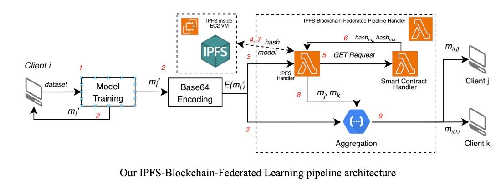
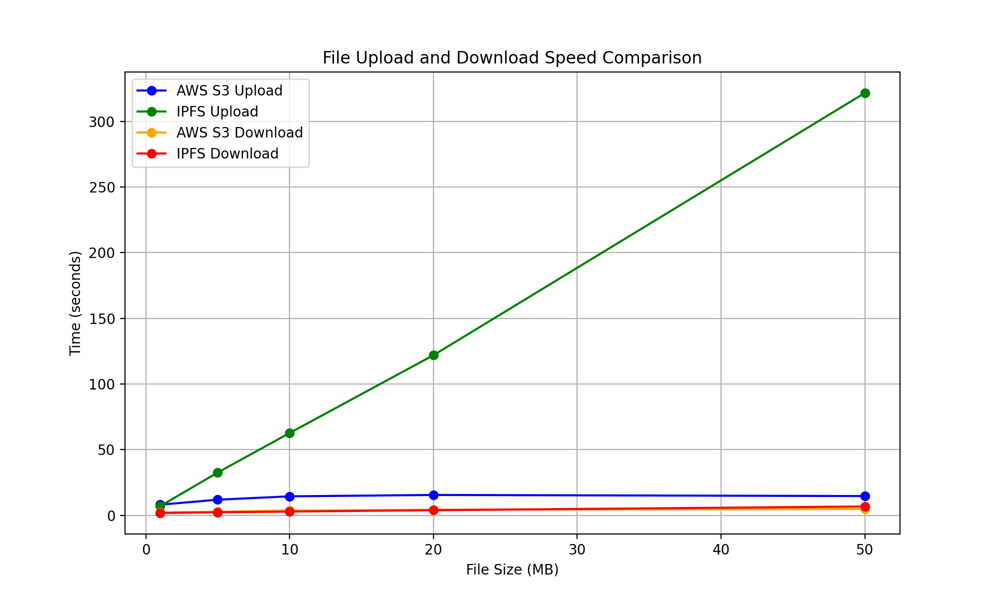

# An IPFS-Blockchain-based Decentralized Federated Learning System for E-Commerce

## Introduction
In deep learning, accessing a large enough dataset and training a model on them are the most common challenges [1]. Especially in e-commerce, it is difficult for a small enterprise to acquire a large enough data sample to train an accurate recommendation system. While pooling data from multiple e-commerce clients to train a centralized model could enhance recommendation performance, such an approach is infeasible due to privacy concerns and long training time. Referencing from the distributed cloud computing anatomy, the Federated Learning (FL) system has emerged as an alternative [2]. Participating entities train models on their local dataset and share updates. However this framework relies on a trusting centralized server. To address these limitations, decentralized FL frameworks have been proposed, leveraging peer-to-peer interactions to eliminate the need for a central coordinator.

We propose an IPFS-Blockchain-based Distributed Decentralized Federated Learning System to facilitate cross-merchant recommendation model training. By leveraging FL systems, combined with blockchain, distributed storage systems, and cloud computing via Function as a Service provider (FaaS), this system provides privacy-protected collaboration and scalability while maintaining robustness. This project primarily focuses on the realization of distributed and parallel collaboration over the Internet rather than AI model optimization.




# File Descriptions 
The `lambda` folder holds all the AWS lambda implementation

1. `base64-to-torch.py` helps decode base64-encoded model and transfer in pytorch model
2. `blockchain-storage.py` handles read and write of data on to smart contract hosted on ETH Speolia Testnet
3. `download-model.py` retrieve torch model from IPFS by first reading the corresponding CID hash from smart contract
4. `federated-learning-gcp.py` handles the federated learning aggregation process
5. `ipfs_storage.js` handles storing and reading file onto IPFS
6. `ipfs-blockchain-federated-pipeline.py` handles the IPFS-Blockchain federating learning pipeline
7. `model-contribute.py` model training program
8. `model-recommend.py` inferencing the model

`app.py` front end UI

The `ml_model` folder stores the trained model in `.pth` and the corresponding dataset used.


# Code Descriptions 

## [Ethereum Smart Contract](eth_smart_contract/store_multiple_hash.sol)
* It stores the CID hashes of trained models stored on IPFS by each client
* This smart contract is published on Ethereum's *Sepolia Testnet*
* Address is 0x980B6A9D39AdbDA1435b8498C429A19e04466237
* Transactions can be viewed on [Etherscan](https://sepolia.etherscan.io/address/0x980b6a9d39adbda1435b8498c429a19e04466237)

## [IPFS Handler](lambda/ipfs_storage.js)
* A lambda handler for file read and write to IPFS
* The IPFS is initiated in the EC2 VM as mentioned below
* All file content should be transformed into **base64 encoded** before uploading
* Sample of file reading via HTTP POST in python
    ```
    url = "https://emviofaj63.execute-api.us-east-1.amazonaws.com/default/ipfs-handler"
    payload = {
        "action": "1",
        "cid": "<CID of that file>"
    }
    response = requests.post(url, json=payload)
    response_data = response.json()
    ```
    > **Note :** Set `action` to "1" for reading and "0" for writing
* Response
    ```
    {   
        "status": 'true',
        "cid": "<CID of the hash>",
        "fileContent" : "<File content in base64 encoded>"
    }
    ```
* Sample of file uploading via HTTP POST in python
    ```
    url = "https://emviofaj63.execute-api.us-east-1.amazonaws.com/default/ipfs-handler"
    payload = {
        "action": "0",
        "fileName": "<File name>"
        "fileContent" : "<File content in base64 encoded>"
    }
    response = requests.post(url, json=payload)
    response_data = response.json()
    ```
* Response
    ```
    {   
        "status": 'true',
        "cid": "<CID of the hash>"
    }
    ```

## [Blockchain Handler](lambda/blockchain-storage.py)
* A lambda handler for uploading and retrieveing hash to and from ETH smart contract
* Digital wallet hard-coded in the function
* Sample hash reading via HTTP POST in python
    ```
    url = "https://r3h9ia9po3.execute-api.us-east-1.amazonaws.com/default/blockchain-storage"
    payload = {
        "action": "1",
        "clientIndex": "<Client index>",
    }
    response = requests.post(url, json=payload)
    ```
    > **Note :** Set `action` to "1" for reading and "0" for writing
* Response
    ```
    {
        'status': 'true',
        'hash': "<hash of the client>",
    }
    ```
* Sample hash uploading via HTTP POST in python
    ```
    url = "https://r3h9ia9po3.execute-api.us-east-1.amazonaws.com/default/blockchain-storage"
    payload = {
        "action": "1",
        "clientIndex": "<Client index>",
        "content" : "<hash to be uploaded>"
    }
    response = requests.post(url, json=payload)
    ```
## [Federated Learning Pipeline Handler](lambda/ipfs-blockchain-federated-pipeline.py)
* A lambda handler for the whole pipeline
* This handler perform the IPFS-Blockchain storage and model aggregation
* Client should first trained a new model with their own dataset locally, then in this handler, we upload the **base64 encoded** model to IPFS and update the smart contract, then initiate [model aggregation handler](lambda/federated-learning-gcp.py) for the other 2 clients parallelly and distributedly
* Noted that the aggregation handler is deployed on Google Cloud Platform cloud run function as we found that it is complicated to add pytorch packages onto AWS lambda, so we used an alternative FaaS
* The aggregation is performed by averaging the weights across models as a simple demo purpose (There are more ways to do so e.g. FedAvg, but here we make the system minimal due to time limitation)
* Then the new models are updated in the IPFS and blockchain storage system
* Sample HTTP POST request in python
    ```
    url = "https://hco230csm8.execute-api.us-east-1.amazonaws.com/default/ipfs-blockchain-federated-pipeline"
    payload = {
        "updatedClientIndex": "<Index of client updated their model>",
        "blockchainEnabled": "1",
        "modelEncoded": "<File content in base64 encoded>"
    }
    response = requests.post(url, json=payload)
    ```
    > **Note :** `blockchainEnabled` is for debugging purpose <code>"0"</code> for debugging so that it will upload NOT to blockchain to save cryptocurrency
* Response
    ```
    {
        "statusCode": 200,
        "body": "true"
    }
    ```
## [Download Model Handler](lambda/download-model.py)
* A GCP Cloud Run Function handler for retrieving the model from IPFS
* First retrive the hash CID from Smart Contract and get the encoded model from IPFS.
    > **Note :** The model is encoded in base64 to reduce length
* Sample HTTP POST request in python
    ```
    import requests

    url = "https://us-central1-bright-calculus-420514.cloudfunctions.net/federated-learning-download-model"
    payload = {
        "clientIndex": "0",
    }

    response = requests.post(url, json=payload)
    ```
* Then the response is decoded and reconstructred to model using `torch.load()`

## [Recommendation System Model](lambda/model-contribute.py)
* We used the “eCommerce behavior data from multi category store” dataset, an open source dataset containing a total of about 285,000,000 rows and 9 columns
* The model is a simple Stochastic Gradient Descent, with inputs consisting of a User to Product matrix (mapped for each User and Product Pair) and a label Tensor based on the action of the user toward a specific product. 
* We used a collaborative filtering system for the users and items as collaborative filtering doesn’t require feature information of users and items besides the user-item interaction data. This ultimately matches our use case. To do that, we have to learn the matrix factorization of the User to Product matrix to represent each of the products and users by 20-dimensional vectors in default. 


## [IPFS AWS Streaming Test](https://drive.google.com/file/d/1k96OHitGjeOGBpBM0z-hefNCLvi87sZ1/view?usp=sharing)
* For security reasons Git do not allow me to upload here
* Performed streaming tests on IPFS hosted on EC2 vs AWS S3 buckets by measuring upload and download time for files of different sizes. (1, 5, 10, 20, 50 MB)
* We can see that generally IPFS takes more time in both operations. 
* Movever, as file size increases, upload time of IPFS increases significantly.
* This highlights the trade-offs between distributed and centralized storage, while IPFS prevents single-point failure, hashing and distributing files across the network becomes a bottleneck, which may not be ideal for high-throughput scenarios involving large files. 

    


# How to Use

## 1. Frontend UI
1.  run `pip install Flask pandas` in the terminal
2.  run the command `python app.py` in the terminal

## 2. Start the IPFS Server
1. Download our AWS key pair from [EC2_instance/COMP4651-project-new.pem]()
    > **Note:** Make sure to save the file in the appropriate directory where you want to work with it.
2. Navigate to the directory \
    Open your terminal and navigate to the directory where the file is saved. For example
3. Run `ssh -i "COMP4651-project-new.pem" ubuntu@ec2-35-168-133-141.compute-1.amazonaws.com`\
    This will connect to our EC2 instance, and the IPFS server will be automatically iniiated

## 3. Whole Process
1. Login in to the corresponding merchant you are, here we assume only 3 merchants
2. In the home page, there will be some general recommendations
3. Click "Get Recommendation" button to inference with the model to get recommendations, able to regenerate
4. Click "Contribute" to start the Federated Learning pipeline
5. At the page, you can add or delete the transaction records you would like to contribute
6. Click "Submit" button to submit the data to model training, then initiate the pipeline to aggregate the model and update for other clients


Demo video: https://drive.google.com/file/d/1HWlZobyp-6UkT7WQhLxLpSzolnWDZBrh/view?usp=sharing

